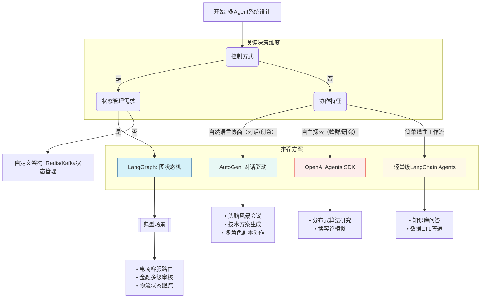

## 一、核心思想一句话总结

*   **<mark style="background: #BBFABBA6;">LangGraph</mark>**: **“流程图”**。它将多智能体协作看作一个**图（Graph）**，每个节点是一个智能体或工具，你可以用代码精确定义它们之间的跳转逻辑和状态，实现对复杂工作流的**极致控制**。
*   **<mark style="background: #BBFABBA6;">AutoGen</mark>**: **“聊天室”**。它将多智能体协作看作一个**对话群组**，智能体之间通过对话和消息传递来协作。它更侧重于**自动化、涌现式**的协作模式。
*   **<mark style="background: #BBFABBA6;">Agent SDK (如 OpenAI Assistants API): “黑盒 API”</mark>**。它提供了一个功能强大、状态持久的**单个智能体**作为服务。构建多智能体系统需要开发者**自行编排**多个这样的 Assistant，框架本身不直接提供多智能体协作机制。
## 二、对比总览表

| ==**对比维度**​== | ==​**LangGraph**​==                                                                                                                                                                                                        | ==​**AutoGen**​==                                                                                          | ==​**OpenAI Agents SDK**​==                                                                                        |
| ------------- | -------------------------------------------------------------------------------------------------------------------------------------------------------------------------------------------------------------------------- | ---------------------------------------------------------------------------------------------------------- | ------------------------------------------------------------------------------------------------------------------ |
| **Releases**  | langgraph4j = [1.6.0-beta4](https://github.com/langgraph4j/langgraph4j/releases/tag/v1.6.0-beta4) star = 592 langgraph = [0.5.0rc1](https://github.com/langchain-ai/langgraph/releases/tag/0.5.0rc1) star = 14.6k | autogen = [python-v0.6.1](https://github.com/microsoft/autogen/releases/tag/python-v0.6.1) star = 46.3k | openai agents sdk = [v0.0.19](https://github.com/openai/openai-agents-python/releases/tag/v0.0.19) star = 11.7k |
| ​**协作模式**​    | 图状态机（节点=Agent，边=逻辑流转）                                                                                                                                                                                                      | 对话式协作（Agent间直接协商） ✅ 2025年5月3号，0.5.6版本已经支持GraphFlow，类似LangGraph（节点=AssistantAgent，边=逻辑流转）                | 蜂群模型（自主决策+松散协作）                                                                                                    |
| ​**统一入口支持**​  | ✅ 原生（通过`StateGraph`定义主节点）                                                                                                                                                                                                  | ❌ 需自定义路由Agent                                                                                              | ❌ 无中心协调者                                                                                                           |
| ​**状态管理**​    | 全局状态对象（支持检查点保存/恢复）                                                                                                                                                                                                         | 分散式（依赖对话历史上下文）                                                                                             | 无强状态管理（实验性）                                                                                                        |
| ​**通信机制**​    | 条件分支驱动（显式调用子Agent）                                                                                                                                                                                                         | 消息传递（自然语言协商）                                                                                               | 自主协商（可能冗余）                                                                                                         |
| ​**流程控制强度**​  | ⭐⭐⭐⭐⭐（强流程）                                                                                                                                                                                                                 | ⭐⭐（弱流程）                                                                                                    | ⭐（无流程）                                                                                                             |
| ​**适用场景举例**​  | 电商客服、金融审核、标准化流程                                                                                                                                                                                                            | 创意生成、会议记录、开放式问题求解                                                                                          | 学术研究、探索性任务                                                                                                         |
| ​**生产环境成熟度**​ | ⭐⭐⭐⭐（企业级可用）                                                                                                                                                                                                                | ⭐⭐⭐（需定制开发）                                                                                                 | ⭐（实验性质）                                                                                                            |
| **支持语言**      | Python、JAVA                                                                                                                                                                                                                | Python                                                                                                     | Python                                                                                                             |
## 三、能力与场景适配分析​

#### ​**1. LangGraph**​

- ​**优势**​
    - ​**动态路由**​：条件分支（`add_conditional_edges`）支持根据状态实时切换子Agent，如电商客服中根据用户意图路由到订单/物流Agent ；
    - ​**状态持久化**​：检查点（Checkpoint）机制保存中间状态，支持异常恢复和分布式部署 ；
    - ​**可视化调试**​：图形化工作流编辑器，降低复杂逻辑调试成本；
    - ​**与LangChain生态集成**​：直接复用LangChain工具链（如RAG、知识库）。
- ​**适用场景**​
    > ✅ ​**需严格流程控制的任务**​：如电商客服（多轮对话）、金融风控（多步骤审核）；  
    > ✅ ​**高容错要求系统**​：状态保存机制保障业务连续性；  
    > ✅ ​**需可视化管理的项目**​：降低多Agent协作的认知负担。
#### ​**2. AutoGen**​

- ​**优势**​
    - ​**灵活协商**​：Agent通过自然语言对话自主协作，适合开放式任务（如创意生成）；
    - ​**双智能体架构**​：内置“用户Proxy+助手”模式，简化任务分发；
    - ​**微软生态集成**​：与Azure服务深度兼容。
- ​**适用场景**​
    > ✅ ​**开放式问题求解**​：如研究协作、头脑风暴；  
    > ✅ ​**对话密集型任务**​：技术支持、会议纪要整理；  
    > ❌ ​**强流程控制场景**​：缺乏中心调度易导致混乱。
#### ​**3. OpenAI Agents SDK**​

- ​**优势**​
    - ​**高度自主性**​：Agent自主决策，适合探索性任务；
    - ​**创新协作模式**​：支持蜂群行为模拟（如分布式研究）。
- ​**适用场景**​
    > ✅ ​**学术研究**​：多Agent探索未知问题域；  
    > ❌ ​**企业生产环境**​：文档匮乏、行为不可预测 。
## 四、如何选择，一张决策流程图

## 五、各框架使用

### 1、LangGraph
[[LangGraph]]

### 2、AutoGen（只是浅显阅读，待深入研究）
doc文档地址：[autogen](https://microsoft.github.io/autogen/stable/index.html#)
![[image-1 2.png|467x310]]
AutoGen 生态系统提供了创建 AI 代理所需的一切，尤其是多代理工作流——框架、开发人员工具和应用程序。
该_框架_采用分层且可扩展的设计。各层职责划分清晰，并构建于下一层之上。这种设计使您可以在不同的抽象级别（从高级 API 到低级组件）使用该框架。

- [核心 API](https://github.com/microsoft/autogen/blob/main/python/packages/autogen-core):
	- 实现了消息传递、事件驱动代理以及本地和分布式运行时，从而实现了灵活性和强大的功能。它还支持 .NET 和 Python 的跨语言支持。
- [AgentChat API](https://github.com/microsoft/autogen/blob/main/python/packages/autogen-agentchat):
	- 实现了一个更简单但更完善的 API，用于快速原型开发。该 API 构建于核心 API 之上，与 v0.2 用户熟悉的版本最为接近，并支持常见的多代理模式，例如双代理聊天或群聊。
- [扩展 API](https://github.com/microsoft/autogen/blob/main/python/packages/autogen-ext):
	- 支持扩展框架功能。它支持 LLM 客户端（例如 OpenAI、AzureOpenAI）的具体实现，以及代码执行等功能。
#### 2.1、AutoGen Studio

AutoGen Studio 是一个低代码界面，旨在帮助快速创建 AI 代理原型，使用工具增强其功能，将其编入团队并与它们交互以完成任务。它基于[AutoGen AgentChat](https://microsoft.github.io/autogen)（一个用于构建多代理应用程序的高级 API）构建。

![[image 4.png]]

AutoGen Studio 是一个研究原型，**不适用于**生产环境。建议采用一些基本实践，例如，为您的代理使用 Docker 代码执行环境。另外，AutoGen Studio 并未实现其他考虑因素，例如与越狱相关的严格测试、确保 LLM 仅在最终用户许可的情况下才能访问正确的数据密钥以及其他安全功能。

[youtube视频地址](https://www.youtube.com/watch?v=oum6EI7wohM)

#### 2.2、AutoGen Core
https://microsoft.github.io/autogen/stable/user-guide/core-user-guide/index.html

AutoGen 核心提供了一种快速构建事件驱动、分布式、可扩展且高弹性的 AI 代理系统的简便方法。代理使用[Actor 模型](https://en.wikipedia.org/wiki/Actor_model)进行开发。您可以在本地构建和运行代理系统，并在准备就绪后轻松迁移到云端的分布式系统。

AutoGen 核心的主要功能包括：

![[image-2 2.png|533x252]]

在多agents模式中，支持很多中场景：
![[image-3 2.png|226x242]]

我将其分为两部分：**主要协作模式** 和 **相关概念**，以便更清晰地理解它们各自的角色。

#表一：主要协作模式对比，这张表的核心是对比 Agent 之间 **如何沟通和协作**。

| 模式 (Pattern) | 核心理念 | 交互方式 | 典型应用场景 | 优点 | 缺点 |
| :--- | :--- | :--- | :--- | :--- | :--- |
| **顺序工作流** (Sequential Workflow) | 像流水线，任务按预定顺序依次传递和处理。 | 链式，一对一 (A→B→C) | 流程固定的任务： • 代码开发流水线 • 报告生成 | 流程清晰，结果可预测，易于调试。 | 灵活性差，无法处理动态变化，中间环节失败易中断。 |
| **群组聊天** (Group Chat) | 多个 Agent 在一个“聊天室”中，由管理员调度发言，动态协作。 | 多对多，动态轮转 | 复杂的、开放式问题： • 头脑风暴 • 产品方案设计 | 极其灵活，能激发集体智慧，解决复杂问题。 | 对话可能混乱，依赖管理员调度，成本高，结果难预测。 |
| **多Agent辩论** (Multi-Agent Debate) | 群聊的特殊形式，通过设置对立观点的 Agent 来进行方案的压力测试。 | 对抗性，多对多 | 需要深入评估的决策： • 技术选型 (React vs. Vue) • 商业策略制定 | 能充分暴露风险，避免思维偏见，产出更稳健的方案。 | 可能陷入僵局，对 Agent 的角色设定（Prompt）要求高。 |
| **反思** (Reflection) | Agent 对自己或他人的产出进行审视、批判和迭代优化。 | 迭代循环 (生成→审查→修改) | 对质量要求极高的任务： • 高质量代码生成 • 文章写作与润色 | 显著提升最终产出质量，自动化纠错。 | 增加执行时间和成本，效果依赖“反思者”的能力。 |

---

#表二：相关概念说明，这张表解释了其他几个重要概念，它们更像是 **能力、架构或编排方式**，而不是具体的协作模式。

| 概念 (Concept) | 核心理念 | 说明 |
| :--- | :--- | :--- |
| **代码执行** (Code Execution) | Agent 的**核心能力**，使其能与外部环境（文件、API、数据库）交互以完成任务。 | 这不是一种协作模式，而是 Agent 完成工作的**手段**。它贯穿于几乎所有有意义的模式中，但存在安全风险，需在沙箱环境（如 Docker）中运行。 |
| **并发Agents** (Concurrent Agents) | **编排方式**：同时运行多个独立的 Agent 对话或工作流，处理互不相关的任务。 | 用于提升系统吞吐量，例如同时分析三家公司的财报。关注点是**并行处理**，而非 Agent 间的协作。 |
| **任务交接** (Handoffs) | **流程动作**：在一个工作流中，一个 Agent（或小组）完成阶段性成果后，将其明确地交给下一个 Agent。 | 这是“顺序工作流”中的关键动作，是连接不同任务阶段的桥梁。 |
| **混合Agents** (Mixture of Agents) | **构建策略**：在一个协作组中，混合使用不同能力、不同底层模型（如 GPT-4, Claude）的 Agent。 | 目的是取长补短，组建一个更强大的“专家团队”。例如，让代码能力强的 Agent 写代码，让逻辑推理强的 Agent 做规划。 |
#### 2.3、AutoGen AgentChat
![[image-5 1.png|294x563]]

基本使用：
![[image-6 1.png|465x342]]
这里重点说一下高级功能，GraphFlow（workflows），类似langgraph
https://microsoft.github.io/autogen/stable/user-guide/agentchat-user-guide/graph-flow.html

示例：
https://www.aivi.fyi/aiagents/introduce-AutoGen-GraphFlow
### 3、OpenAI Agents SDK

